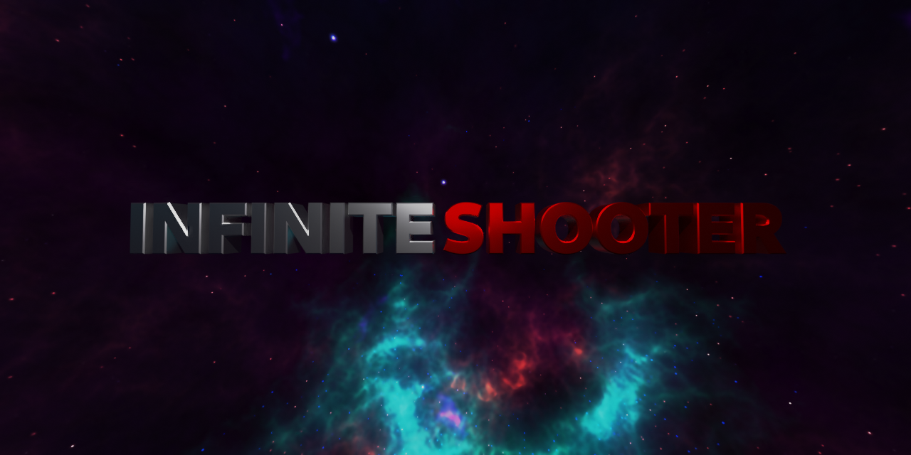

  

# Screenshots
<!-- Have to do some HTML wizardry to get these screenshots to not be completely large and not side-by-side -->

  
  
  
  
  
  

# Installation
## GNU/Linux
1. Go to the Releases tab.
2. Download `InfiniteShooter.flatpak` from the latest version of InfiniteShooter
3. Open the terminal in your downloads folder and type `flatpak install InfiniteShooter.flatpak`.
4. Profit

# Hardware/software requirements

**Minimum hardware**: I tested this generally on an Intel Pentium processor. Unfortunately, since I don't know which, I can only garuntee that it works within this range. I'm guessing since there are many performance optimizations and that there is no heavy rendering going on that you can run this on any Pentium, but beware.  
**Tested hardware**: AMD Ryzen 5 3500U with mobile graphics (Lenovo ThinkPad E595). Watch out for some stuttering with this hardware.  
**Recommended hardware**: Nvidia GeForce GTX 1050 or higher (a.k.a anything above the tested hardware should work fine. Better GPU == better overall performance in most cases)  
**Recommended OS**: GNU/Linux (specifically Arch or Fedora Linux. Alpine Linux (Busybox/Linux) has not been tested but if there's a Godot runner it should be fine. Watch for audio potentially randomly clipping out on Windows 10 or higher)  
**Tested OS**: Fedora 34

# Contributing
TODO: Make CONTRIBUTING.md

# Trivia
This game was my final project for my Computing Science 10 class! The first ever version (before 1.0) was made ~June of 2021 and since then the game's received a lot of improvements.  
But expect more changes to come! You can see my port of InfiniteShooter to the Godot engine in the `godotengine-port` branch.

## Roadmap for the future
- [.] Improve gameplay (somehow)
- [ ] Release on Steam, possibly using: https://gramps.github.io/GodotSteam
    - [ ] Achievements handled on Steam's server side (no in-game menu makes programming easier)
    - [ ] Up to 4 person multiplayer?

## Known (and unfixable) issues
- Instancing scenes for the first time can be very slow, especially on older hardware. This is because Godot is compiling shaders for each scene when it instances for the first time. There should be a fix in Godot 4.0 (but the chances of that releasing soon are as slim as HL3 releasing soon). All issues related to slowness should also be fixed in Godot 4.

# Credits
All assets are made by me using Blender/Illustrator/Inkscape/GIMP/LMMS/Audacity.  
Except for two: The laser sounds are from user Defunct3 right [here](https://freesound.org/people/Defunct3/sounds/77172/) and the sound effect for transitions is from user qubodup and you can find it [here](https://freesound.org/people/qubodup/sounds/60013/), both on freesound.org.
